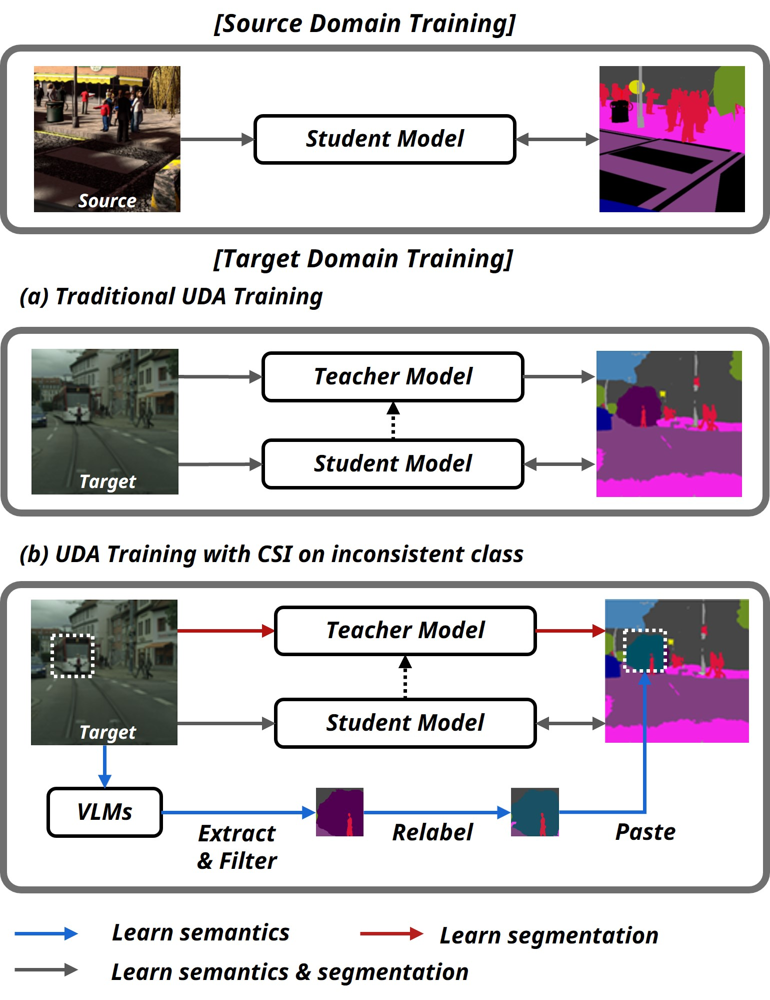

# Cross-Domain Semantic Segmentation on Inconsistent Taxonomy using VLMs

**by
[Jeongkee Lim](https://jkee58.github.io/), and
[Yusung Kim](https://scholar.google.com/citations?user=xGbTgpoAAAAJ&hl=en)**

**[[ECCV24 Paper]](https://link.springer.com/chapter/10.1007/978-3-031-73650-6_2)**

:bell: We are happy to announce that CSI was accepted at **ECCV24**. :bell:

## Overview

The challenge of semantic segmentation in **Unsupervised Domain Adaptation (UDA)** emerges not only from domain shifts between source and target images 
but also from discrepancies in class taxonomies across domains. Traditional UDA research assumes consistent taxonomy between the source and target domains, 
thereby limiting their ability to recognize and adapt to the taxonomy of the target domain. 

We introduces a novel approach, Cross-Domain Semantic Segmentation on Inconsistent Taxonomy using Vision Language Models (CSI), which effectively performs domain-adaptive semantic segmentation even in situations of source-target class mismatches. 
CSI leverages the semantic generalization potential of Visual Language Models (VLMs) to create synergy with previous UDA methods. It leverages segment reasoning obtained through traditional UDA methods, combined with the rich semantic knowledge embedded in VLMs, to relabel new classes in the target domain.



This approach allows for effective adaptation to extended taxonomies without requiring any ground truth label for the target domain. Our method has shown to be effective across various benchmarks in situations of inconsistent taxonomy settings (coarse-to-fine taxonomy and open taxonomy) and demonstrates consistent synergy effects when integrated with previous state-of-the-art UDA methods. If you find CSI useful in your research, please consider citing.

```
@inproceedings{lim2025cross,
  title={Cross-Domain Semantic Segmentation on Inconsistent Taxonomy using VLMs},
  author={Lim, Jeongkee and Kim, Yusung},
  booktitle={European Conference on Computer Vision},
  pages={18--35},
  year={2025}
}
```

## Environment Setup

### Install Libraries

#### Recommended library version

| Library        | Version |
|----------------|---------|
| Python         | 3.8.x   |
| CUDA           | 12.1    |
| MMCV           | 2.1.0   |
| MMSegmentation | 1.2.2   |

For this project, we used python 3.8.x and CUDA 12.1. We recommend setting up a new virtual environment.

```
conda create --name csi python=3.8 setuptools=58.2 -y
conda activate csi
conda install pytorch==2.1.2 torchvision==0.16.2 torchaudio==2.1.2 pytorch-cuda=12.1 -c pytorch -c nvidia -y
```

Install the requirements.

```shell
pip install mmengine
pip install mmcv==2.1.0 -f https://download.openmmlab.com/mmcv/dist/cu121/torch2.1/index.html
pip install -v -e .
```

### Download Pretrained Weights

Download the [MiT-B5 weight](https://drive.google.com/drive/folders/1b7bwrInTW4VLEm27YawHOAMSMikga2Ia?usp=sharing).

MiT-B5 pretrained on ImageNet-1K provided by the official [SegFormer repository](https://github.com/NVlabs/SegFormer).

Put the pretrained weights in a folder `pretrained/` within this project.

### Download Datasets

**Synthia:** Please, download SYNTHIA-RAND-CITYSCAPES from
[here](http://synthia-dataset.net/downloads/) and extract it to `data/synthia`.

**Cityscapes:** Please, download leftImg8bit_trainvaltest.zip and
gt_trainvaltest.zip from [here](https://www.cityscapes-dataset.com/downloads/)
and extract them to `data/cityscapes`.

**GTA (Optional):** Please, download all image and label packages from
[here](https://download.visinf.tu-darmstadt.de/data/from_games/) and extract
them to `data/gta` and `data/gta16`.

**ACDC (Optional):** Please, download rgb_anon_trainvaltest.zip and
gt_trainval.zip from [here](https://acdc.vision.ee.ethz.ch/download) and
extract them to `data/acdc`. Further, please restructure the folders from
`condition/split/sequence/` to `split/` using the following commands:

```shell
rsync -a data/acdc/rgb_anon/*/train/*/* data/acdc/rgb_anon/train/
rsync -a data/acdc/rgb_anon/*/val/*/* data/acdc/rgb_anon/val/
rsync -a data/acdc/gt/*/train/*/*_labelTrainIds.png data/acdc/gt/train/
rsync -a data/acdc/gt/*/val/*/*_labelTrainIds.png data/acdc/gt/val/
```

The final folder structure should look like this:

```none
CSI
├── ...
├── data
│   ├── acdc (optional)
│   │   ├── gt
│   │   │   ├── train
│   │   │   ├── val
│   │   ├── rgb_anon
│   │   │   ├── train
│   │   │   ├── val
│   ├── cityscapes
│   │   ├── leftImg8bit
│   │   │   ├── train
│   │   │   ├── val
│   │   ├── gtFine
│   │   │   ├── train
│   │   │   ├── val
│   ├── gta
│   │   ├── images
│   │   ├── labels
│   ├── gta16
│   │   ├── images
│   │   ├── labels
│   ├── synthia
│   │   ├── RGB
│   │   ├── GT
│   │   │   ├── LABELS
├── ...
```

### Data Preprocessing

Please run the following scripts to convert the label IDs to the train IDs and to generate the class index for RCS.

```shell
python tools/convert_datasets/synthia.py data/synthia/ --nproc 8
python tools/convert_datasets/cityscapes.py data/cityscapes/ --nproc 8
python tools/convert_datasets/gta.py data/gta --nproc 8
python tools/convert_datasets/gta16.py data/gta16 --nproc 8
```

## Training

For the experiments in our paper, we use a script to automatically generate and train the configs.

```shell
python run_experiments.py --exp <ID>
```

The logs and checkpoints are stored in `work_dirs/`.

| Experiment ID | Description |
|---------------|-------------|
| 90            | Table 1     |
| 91            | Table 2     |
| 92            | Table 3     |
| 93            | Table 4     |
| 94            | Table 5     |

## Evaluation

A trained model can be evaluated using script.

```shell
python tools/test.py config_path checkpoint_path --cfg-options default_hooks.visualization.interval=1 default_hooks.visualization.mode_prefix=False uda.mask_mode=None
```

The predictions are saved for inspection to
`work_dirs/run_name/preds`
and the mIoU of the model is printed to the console.

## Framework Structure

This project is based on [mmsegmentation version 1.2.2](https://github.com/open-mmlab/mmsegmentation/tree/v1.2.2).
For more information about the framework structure and the config system,
please refer to the [mmsegmentation documentation](https://mmsegmentation.readthedocs.io/en/latest/index.html)
and the [mmcv documentation](https://mmcv.readthedocs.io/en/2.x/index.html).

The most relevant files for CSI are:

* [experiments.py](experiments.py):
  Definition of the experiment configurations in the paper.
* [mmseg/models/utils/patch_master.py](mmseg/models/utils/patch_master.py):
  Implementation of the patch extraction and classification.
* [mmseg/models/utils/clip_guide.py](mmseg/models/utils/clip_guide.py):
  Code for the CLIP and OWL-ViT
* [mmseg/models/utils/relabeling_map.py](mmseg/models/uda/relabeling_map.py):
  Implementation of the relabeling map
* [mmseg/models/uda/dacs.py](mmseg/models/uda/dacs.py):
  Implementation of the DAFormer/HRDA/MIC self-training with integrated CSI

## Acknowledgements

This project is based on the following open-source projects. We thank their authors for making the source code publically available.

* [MIC](https://github.com/lhoyer/MIC)
* [HRDA](https://github.com/lhoyer/HRDA)
* [DAFormer](https://github.com/lhoyer/DAFormer)
* [MMSegmentation](https://github.com/open-mmlab/mmsegmentation)
* [SegFormer](https://github.com/NVlabs/SegFormer)
* [DACS](https://github.com/vikolss/DACS)